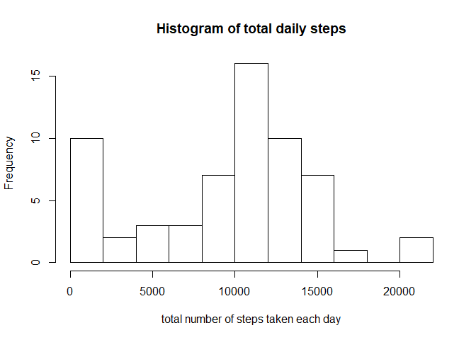
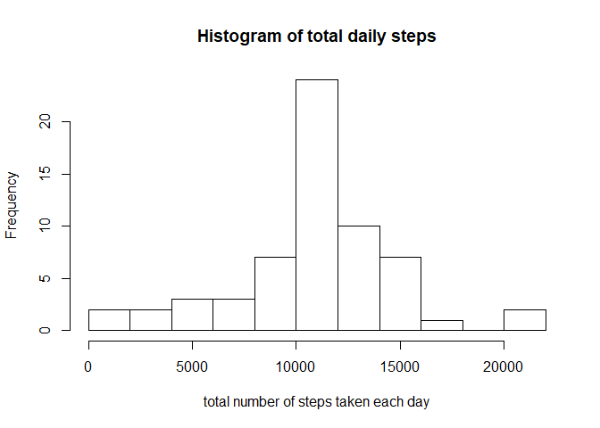
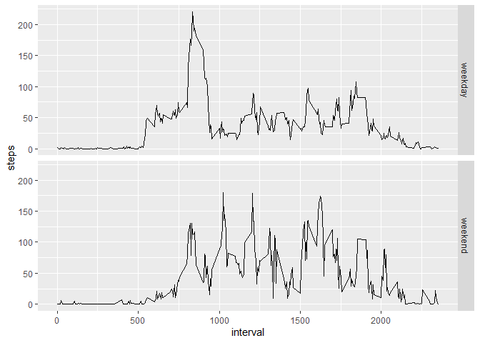

## Loading and preprocessing the data

```r
library(ggplot2)
library(dplyr)
```

```
## 
## Attaching package: 'dplyr'
```

```
## The following objects are masked from 'package:stats':
## 
##     filter, lag
```

```
## The following objects are masked from 'package:base':
## 
##     intersect, setdiff, setequal, union
```

```r
data <- read.csv("activity.csv")
```


## What is mean total number of steps taken per day?


```r
daylyData <- data %>% group_by(date) %>% summarise(steps = sum(steps, na.rm = TRUE ))

hist(daylyData$steps, breaks = 10, xlab = "total number of steps taken each day" , main = "Histogram of total daily steps")
```

<!-- -->

```r
mean <- mean(daylyData$steps)
median <- median(daylyData$steps)
```

-The mean steps per day are **9354.2295082** 

-The median steps per day are **10395**


## What is the average daily activity pattern?

```r
dataIntervals <- data %>% group_by(interval) %>% summarise(steps = mean(steps, na.rm = TRUE ))

ggplot(data = dataIntervals) + geom_line(aes(x=interval, y=steps))
```

<!-- -->

```r
maxInterval <- dataIntervals %>% filter(steps == max(steps))
```

The **835** is the 5 minutes interval with maximum average steps value of  **206.1698113** 

## Imputing missing values
#### Number of missing values in the dataset

```r
data %>% filter(is.na(steps))%>% nrow()
```

```
## [1] 2304
```

#### Strategy for filling in all of the missing values in the dataset
All the NA values are filled with the 5 minutes interval mean 


```r
dataIntervals <- data %>% group_by(interval) %>% summarise(meanInterval = mean(steps, na.rm = TRUE ))

dataInputed <- merge(x = data, y = dataIntervals, by.x = "interval", by.y = "interval")

dataInputed <- dataInputed %>% mutate(steps = ifelse(is.na(steps),meanInterval, steps),
                                      meanInterval = NULL)

daylyDataInputed <- dataInputed %>% group_by(date) %>% summarise(steps = sum(steps, na.rm = TRUE ))

hist(daylyDataInputed$steps, breaks = 10, xlab = "total number of steps taken each day" , main = "Histogram of total daily steps")
```

<!-- -->

```r
mean <- mean(daylyDataInputed$steps)
median <- median(daylyDataInputed$steps)
```

-In the data Inputed dataframe the mean steps per day are **1.0766189\times 10^{4}** 

-In the data Inputed dataframe the median steps per day are **1.0766189\times 10^{4}**


## Are there differences in activity patterns between weekdays and weekends?

```r
dataInputed <- dataInputed %>% mutate(date = as.POSIXct(as.Date(date))) %>%mutate(weekday = as.factor(ifelse(as.POSIXlt(date)$wday <6 ,"weekday", "weekend")))
  
dataIntervals <- dataInputed %>% group_by(interval,weekday) %>% summarise(steps = mean(steps, na.rm = FALSE ))

ggplot(data = dataIntervals) + geom_line(aes(x=interval, y=steps)) + facet_grid(weekday~. )
```

<!-- -->

